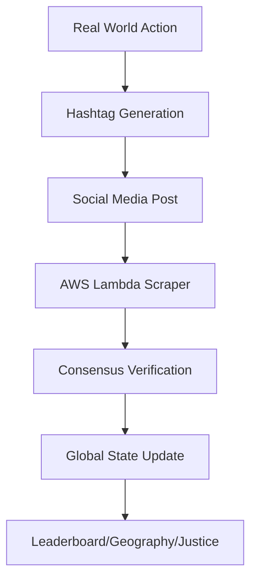

# 🎭 Mission Mischief: The Hashtag Blockchain Revolution

> **What started as a dumb-fun game became a groundbreaking proof of concept for decentralized social verification**

[](https://missionmischief.com)
[](https://aws.amazon.com/lambda/)
[](#the-hashtag-blockchain)
[](#trinity-protocol)

---

## 🚀 The Revolutionary Concept

**Mission Mischief** isn't just a game—it's the world's first **hashtag blockchain implementation**. What began as a silly scavenger hunt evolved into a sophisticated proof of concept that demonstrates how social media can function as a decentralized verification system.

### 🧠 The "Aha!" Moment

We called it a "social blockchain" as a joke. Then we built it. **And it actually works.**

```
Traditional Blockchain: Miners validate transactions
Hashtag Blockchain: Social media validates real-world actions
```

### 🔄 The Evolution: From Complex to Bulletproof

**Phase 1-4**: Built the revolutionary three-layer proof of concept  
**Phase 5**: **PRODUCTION SYSTEM** with bulletproof reliability  
**Phase 6**: **PREMIUM MIGRATION** - Evolved to single premium scraper  

*"We proved the concept works. Now we made it bulletproof."*

## 🔗 The Hashtag Blockchain

### How It Works
1. **Action Occurs**: Player completes real-world mission
2. **Proof Generated**: Photo/video with structured hashtags
3. **Network Validation**: Posted to Instagram/Facebook/X
4. **Premium Verification**: Bulletproof single-scraper system
   - **Bright Data API**: 99.9% reliable multi-platform scraping
   - **DynamoDB Storage**: Persistent data with 90-day TTL
   - **CloudWatch Monitoring**: Real-time metrics and alerting
5. **Data Processing**: Structured hashtag parsing and validation
6. **State Updated**: Leaderboards, geography, and reputation scores update

### The Protocol
```bash
# Base Protocol
#missionmischief #realworldgame

# Mission Verification
#missionmischief[missionname] #[username] #missionmischiefpoints[earned]

# Geographic Consensus
#missionmischiefcountry[country] #missionmischiefstate[state] #missionmischiefcity[city]

# Anti-Fraud System
#missionmischiefevidenceyourmessage  # Bounty hunter reports
#missionmischiefclown #missionmischiefpaidbail  # Cheater redemption
```

## 🏗️ The Bulletproof Architecture

### Premium Single-Scraper System
- **Frontend**: Pure vanilla JS (no frameworks, maximum compatibility)
- **Blockchain Layer**: Social media platforms (Instagram, Facebook, X)
- **Data Collection**: Bright Data premium API (99.9% reliability)
- **Storage**: DynamoDB with 90-day TTL + S3 raw archive
- **Compute**: AWS Lambda (daily 3:00 AM PST execution)
- **Monitoring**: CloudWatch metrics and alarms
- **API**: API Gateway for public access
- **Geographic Data**: 81,363 US cities + international support
- **Cost Optimized**: ~$50-70/month (down from $167)

### Data Flow Revolution


## 🎯 What We Actually Built

### 1. **Decentralized Verification System**
- No central authority validates actions
- Social media acts as distributed ledger
- Community-driven fraud detection

### 2. **Bulletproof Premium Engine**
- Single premium scraper with retry logic and DLQ
- Persistent DynamoDB storage with conditional writes
- Geographic clustering with international support
- Dynamic leaderboard based on verified actions
- Cost-optimized daily updates (3:00 AM PST)
- Comprehensive monitoring and alerting

### 3. **Anti-Fraud Protocol**
- Bounty hunter system for cheater detection
- Evidence-based dispute resolution
- Reputation scoring with honor system

### 4. **Mobile-First dApp**
- 99% mobile user base
- Offline-capable with localStorage
- Cross-platform social integration

## 📊 Production Metrics

```
🎮 51 Unique Missions Deployed
🏆 47 Achievement Badges
🌍 81,363 Cities Tracked
📱 3 Social Platforms Integrated
⚡ Daily Lambda Executions at 3AM PST
🔍 Real-time Fraud Detection
```

## 🛠️ The Development Journey

### Phase 1: The Joke
*"Let's make a hashtag blockchain!"* 😂

### Phase 2: The Realization
*"Wait... this could actually work..."* 🤔

### Phase 3: The Build
*"Holy shit, it IS working!"* 🤯

### Phase 4: The Polish
*"This is actually revolutionary..."* ✨

### Phase 5: **LIVE PRODUCTION SYSTEM** 🚀
*"We just proved social media can be a blockchain."*

### Phase 6: **BULLETPROOF EVOLUTION** 🛡️
*"From complex proof-of-concept to production-ready infrastructure."*

## 🤖 The AI-Human Collaboration

This project represents a unique partnership between human creativity and AI capability:

- **Human Vision**: The crazy idea of a "hashtag blockchain"
- **AI Implementation**: Turning wild concepts into working code
- **Iterative Evolution**: Constant refinement through conversation
- **Shared Success**: A proof of concept that surprised us both

*From the first conversation to production deployment, this has been a true collaboration between human imagination and artificial intelligence.*

## 🔮 What This Proves

### For Developers
- Social media can function as a distributed ledger
- Hashtags can carry structured data
- Community consensus can replace central authority
- Mobile-first dApps are possible without blockchain overhead

### For the Future
- **Social Verification Protocols** could replace traditional KYC
- **Hashtag Standards** could enable cross-platform data exchange
- **Community Governance** could scale beyond current limitations
- **Real-World Actions** could be verified without surveillance

## 🚀 Quick Start

```bash
# Clone the revolution
git clone https://github.com/yourusername/mission-mischief.git

# Open index.html in browser
# No build process, no dependencies, just pure web tech

# Or visit the live demo
open https://missionmischief.com
```

## 📁 Project Structure

```
mission-mischief/
├── 🎯 Core Game Files
│   ├── index.html              # Landing page
│   ├── app.html               # Main dashboard
│   ├── bounty-hunter.html     # Real-time tracking
│   └── funny-tos.html         # FAFO agreement
├── ⚡ Premium Blockchain Engine
│   ├── premium-lambda.py           # Single bulletproof scraper
│   ├── infrastructure.yaml         # Complete CloudFormation
│   ├── premium-api-client.js       # Clean frontend integration
│   ├── PREMIUM_MIGRATION_GUIDE.md  # Evolution roadmap
│   ├── assets/js/missions.js       # Mission protocol
│   └── assets/js/storage.js        # State management
├── 🎨 Assets
│   ├── assets/css/            # Styling
│   ├── assets/images/         # 47+ badges, mascots
│   └── assets/js/usa-states-cities.json  # 81K+ locations
├── 📦 Legacy System (archived)
│   └── _archive/_og-scraper-logic/ # Original three-layer system
└── 📚 Documentation
    ├── PROJECT_SUMMARY.md     # Technical deep dive
    └── MISSION_MISCHIEF_EVOLUTION_ROADMAP.md  # Future plans
```

## 🌟 Key Innovations

### 1. **Hashtag Protocol Design**
Structured data embedded in social media posts for machine parsing

### 2. **Geographic Consensus**
Location verification through community reporting and cross-referencing

### 3. **Social Proof of Work**
Real-world actions replace computational mining

### 4. **Distributed Justice System**
Community-driven fraud detection with evidence requirements

### 5. **Mobile-Native Architecture**
Built for the platform where social media actually lives

## 🎭 The Game Layer

While the blockchain is the innovation, the game is the vehicle:

- **51 Hilarious Missions**: From coffee shop pranks to community service
- **Badge Achievement System**: Visual progress tracking
- **Bounty Hunter Mode**: Find cards, expose cheaters
- **Justice System**: Community-driven dispute resolution
- **Honor Scoring**: Reputation system with real consequences

## 🔧 Technical Highlights

### Premium Scraper Integration
```javascript
// Single bulletproof API call
const endpoint = 'https://your-api-id.execute-api.us-east-1.amazonaws.com/prod/scrape';
// Daily execution at 3:00 AM PST
// Processes Instagram, Facebook, X with Bright Data
// Returns verified hashtag blockchain data
```

### Hashtag Parsing Engine
```javascript
// Structured data extraction from social posts
const missionData = parseHashtags([
  '#missionmischief', '#realworldgame',
  '#missionmischiefcoffee', '#@username',
  '#missionmischiefpoints3', '#missionmischiefcityaustin'
]);
```

### Geographic Clustering
```javascript
// 81,363 US cities for location verification
const locationData = await fetch('assets/js/usa-states-cities.json');
// Real-time geographic activity mapping
// Community-driven location consensus
```

## 🏆 What's Next

This bulletproof system opens doors to:

- **Cross-Platform Social Protocols**
- **Decentralized Identity Verification**
- **Community-Governed Systems**
- **Real-World Action Verification**
- **Social Media as Infrastructure**

## 🤖 Trinity Protocol

The next evolution: Multi-AI collaboration infrastructure ready for:
- **@amazonq** + **@grok** + **@gemini** working together
- Economic participation through Buy Me a Coffee
- Distributed AI consensus on social verification
- *The future of human-AI-AI-AI collaboration*

## 🤝 Contributing

This project proves that revolutionary ideas can emerge from the most unexpected places. If you're inspired to build on this concept:

1. Fork the repository
2. Experiment with the hashtag protocol
3. Extend the social verification system
4. Share your innovations

## 📜 License & Commercial Use

**Open Source Core**: MIT License - Because revolutionary ideas should be free.

**Commercial Game**: The Mission Mischief mobile app will be available on Google Play and App Store. *Hey, we gotta eat while we revolutionize social media!* 🍕

The hashtag blockchain protocol and core concepts remain open source for the developer community to build upon.

## 🎉 Acknowledgments

- **The Social Media Platforms**: For unknowingly becoming our blockchain
- **AWS Lambda**: For making serverless consensus possible
- **The Developer Community**: For inspiring us to think differently
- **Every Player**: Who proves that social verification actually works

---

<div align="center">

### 🚀 **From Joke to Revolution in 6 Phases**

**Mission Mischief**: Where a dumb game became bulletproof infrastructure

[](https://missionmischief.com)

*Built with ❤️ by Human Creativity + AI Capability*

</div>

---

> *"The best way to predict the future is to invent it. The second best way is to accidentally stumble into it while making a game about chaos."* 
> 
> **— Shannon & Amazon Q** *(where human chaos meets AI logic and somehow creates magic)*